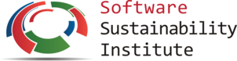



The [Citation File Format (CFF)](https://citation-file-format.github.io/) is a human-centric, machine-readable format for software citation metadata. It is developed to provide an easy way for RSEs, and other developers of software in academia, to ensure that they can receive credit for their work; Likewise, it provides researchers with access to the necessary metadata for references to the software they use in their research. The Citation File Format follows the [Software Citation Principles](https://peerj.com/articles/cs-86/), and is compatible with the [CodeMeta](http://codemeta.github.io/) JSON-LD exchange format for software metadata. It is being developed in the context of the [FORCE11 Software Citation Implementation Working Group](https://www.force11.org/group/software-citation-implementation-working-group) and a wider community of stakeholders, including the [Netherlands eScience Center](https://www.esciencecenter.nl/). Recently, CFF has been adopted by [CiteAs.org](http://citeas.org/) as a source format, and its tools infrastructure is growing.

## Hack Day at the 3rd Conference of Research Software Engineers

During a dedicated **Hack Day on Wednesday, 5 September** - co-locating with the [3rd Conference of Research Software Engineers (RSE18)](http://rse.ac.uk/conf2018/) in Birmingham - we want to 

- *a)* give an overview of - and discuss - the Citation File Format, its tooling and workflows; 
- *b)* discuss what tools would be necessary to facilitate, e.g., better usability, optimized workflows, or integration with other tools in the software citation workflow (reference managers, repositories, other formats, etc.); 
- *c)* do some actual work around existing and new tools, as well as the Citation File Format itself and its documentation.

**The hack day is now fully booked!** If you have re-confirmed your participation
via email to Stephan Druskat, you will have received a confirmation email and preliminary infos
about the hack day, and have a place.  
Please confirm your wish to participate via email to *stephan* [dot] *druskat* 
[at] *hu-berlin* [dot] *de* to be added to the waiting list. If space becomes available for you,
you will be notified via email.
{: .notice--danger}

## Location

The hack day will take place in the **Murray Learning Centre**, R28,
University of Birmingham, Birmingham B15 2FG
([Google Maps](https://goo.gl/maps/UDPocWznNW52), [Walking Map](walking-map.pdf): marked as "Learning Centre" on p.2 
below the legend), room tbc.

The international morning
meeting and the Tier-2/HPC workshop will also take place there, so that
you can meet delegates from the other events during lunch and coffee breaks.

### Pre-Hack Day Social 
On the evening before the hack day, if you want to get to know your fellow 
hackers in advance, there will be an **informal get-together**, and you're invited 
to come along for a drink and a chat. We'll meet at the [Arco Lounge](https://thelounges.co.uk/arco/)
(147 High Street, Harborne, Birmingham, B17 9NP - [Google Maps](https://goo.gl/maps/YkDAuqYszWF2))
from around 18:00 on Tuesday, 4 September. They have food as well (including quite a few vegan options).

## Agenda

### Tuesday, 4 September 2018

**RSE Talk:** Tuesday, 4 September 2018, [13:30, parallel session 4, Track B](https://rse.ac.uk/conf2018/programme/) -    
S. Druskat: *"YOU HAVE 0 CREDIT – PLEASE INSERT C̶O̶I̶N̶ FILE": The Citation File Format*

**Pre-Hack Day Social:** Tuesday, 4 September 2018, from ca. 18:00, [Arco Lounge](https://thelounges.co.uk/arco/)
{: .btn--break .btn--info}

<i class="fa fa-fw fa-twitter" aria-hidden="true"></i> If you want to tweet about the hack day, please use the hashtag **#cffhackday**.
{: .notice--info}

### Wednesday, 5 September 2018, 09:00 - 17:00

**09:00** - *Registration: Coffee and Tea*
{: .btn--break .btn--info}

**09:15** - Introductions  
**09:30** - **Talk:** "Brief introduction to the Citation File Format" (S. Druskat)  
**09:50** - **Talk:** "The Citation File Format at the Netherlands eScience Center" (J. Spaaks)  
**10:15** - **Hack idea pitches & group formation** (<http://bit.ly/cff-hack-ideas>)
{: .btn--break .btn--warning}

**10:45** - *Coffee and Tea break*
{: .btn--break .btn--info}

 **11:00** - **Hacking in groups**  
{: .btn--break .btn--success}  

**12:00** - *Lunch*
{: .btn--break .btn--info}

**12:30** - **Hacking updates** (plenary)
{: .btn--break .btn--warning}

 **12:45** - **Hacking in groups**  
{: .btn--break .btn--success}

**14:30** - *Coffee and Tea break*
{: .btn--break .btn--info}
  
 **14:45** - **Hacking in groups**  
{: .btn--break .btn--success}

**16:00** - **Hacking reports & Wrap-up**
{: .btn--break .btn--warning}

**17:00** - *End*
{: .btn--break .btn--info}

## Hack ideas

If you have an idea how the Citation File Format, its tooling, its
documentation, or its integration in the software citation workflow could be 
improved, you **please register your hack idea** in the 
Hack Ideas Spreadsheet at <http://bit.ly/cff-hack-ideas>.  
If you register a hack idea, please be prepared to present a very short
pitch of the idea during the hack day.

## Code of Conduct

I want to make sure that the hack day is welcoming and friendly to everyone.
Therefore, **please read Code of Conduct. You are expected to adhere to it.**
It can be read here: <https://citation-file-format.github.io/events/coc>.

## Resources

- The main resource for the Citation File Format itself is the [**project
website**](https://citation-file-format.github.io). Some basic info can
also be found at <https://cite.research-software.org>.
- <i class="fa fa-fw fa-slack" aria-hidden="true"></i> **Slack channel:** I've set up a Slack channel for the hack day. Please join it, 
using this link: <http://bit.ly/cff-hack-day-slack-invite>! If you haven't used Slack
before, some info on getting started can be found at <https://get.slack.help/hc/en-us/categories/360000049043>
- <i class="fa fa-fw fa-github" aria-hidden="true"></i> **GitHub:** The suggested code platform to use for any hacktivities
during the hack day. Please create an account on GitHub if you haven't
got one yet. Some info to get you started can be found at <https://guides.github.com/activities/hello-world/>.
- <i class="fa fa-fw fa-twitter" aria-hidden="true"></i> If you want to tweet about the hack day, please use the hashtag **#cffhackday**.

## Contact

Please **get in touch** with any questions and comments via email to
*stephan* [dot] *druskat* [at] *hu-berlin* [dot] *de*.

---

## Thanks

I'd like to thank the following for their great help and support in organizing this hack day:

- [#RSE18 organizing committee](https://rse.ac.uk/conf2018/contacts/), especially Louise Brown, 
Claire Wyatt, and Catherine Jones
- John Owen and Andrew Edmondson from the University of Birmingham's IT Services and IT Research Support
respectively

The hack day is financed through a grant from the [Software Sustainability Institute](https://software.ac.uk). Many thanks!

